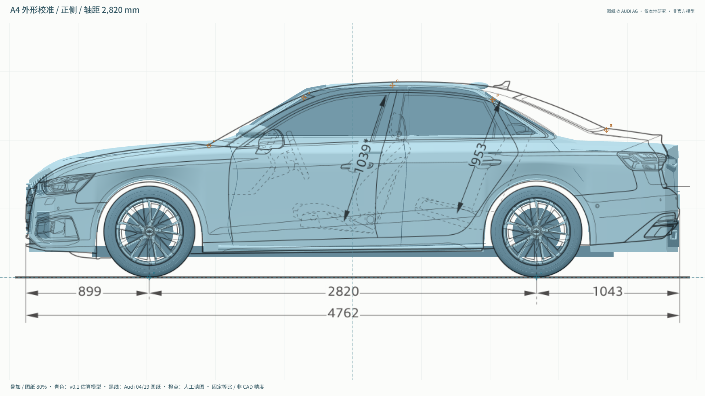
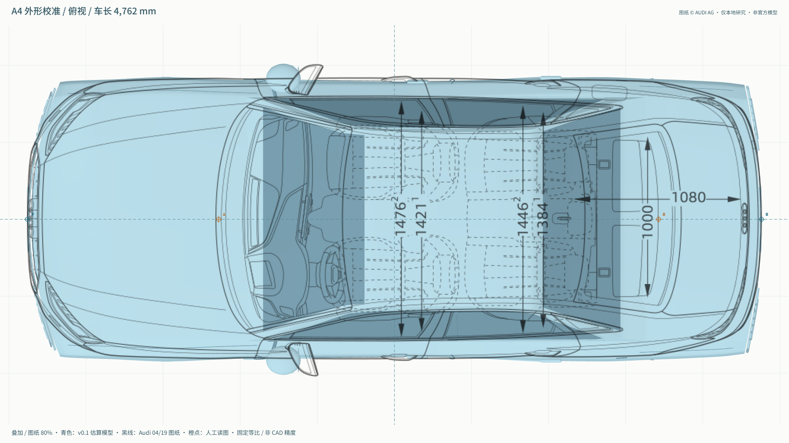
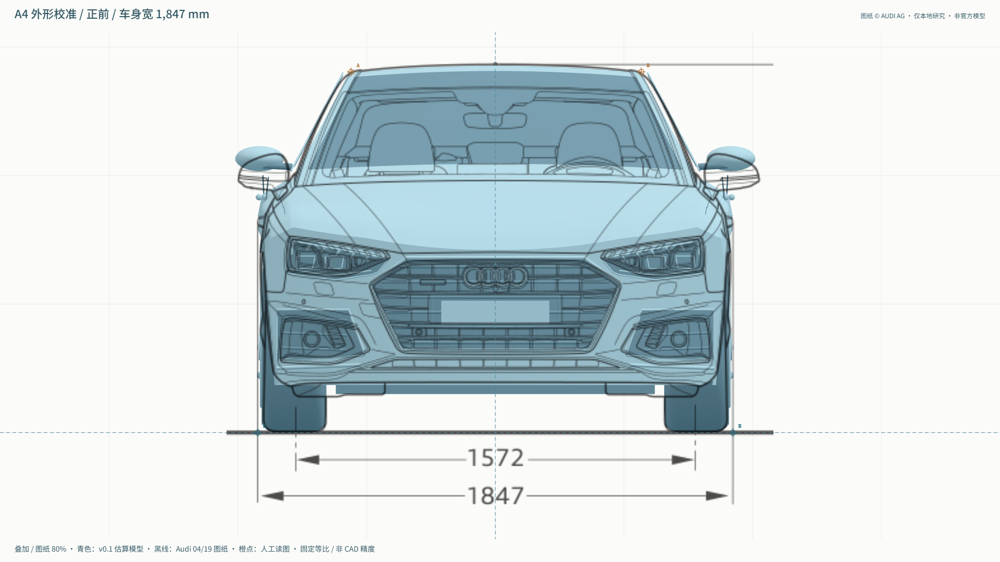
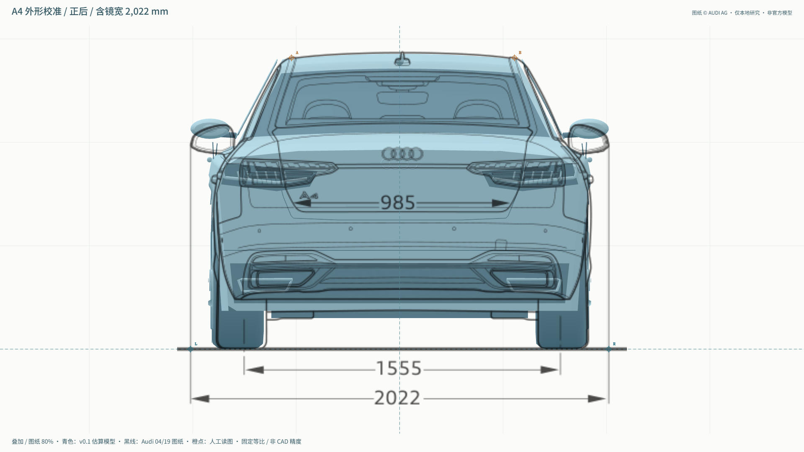
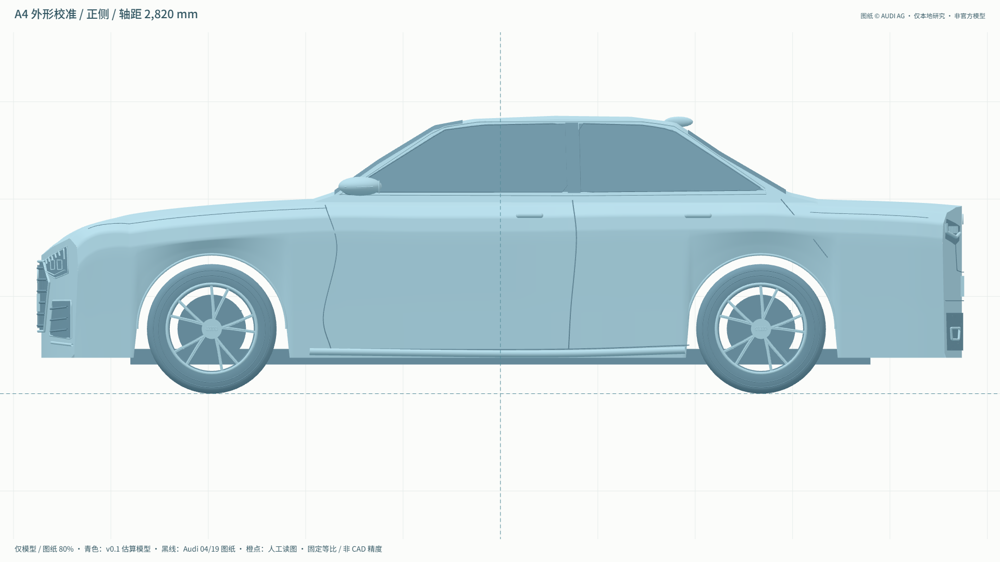
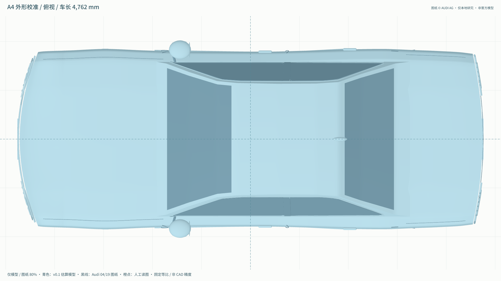
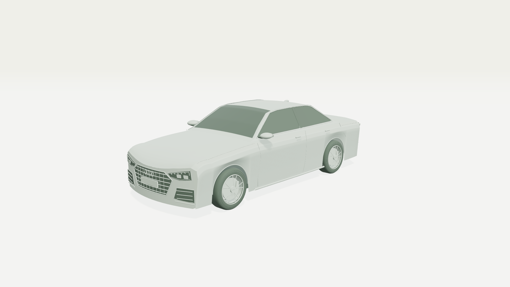
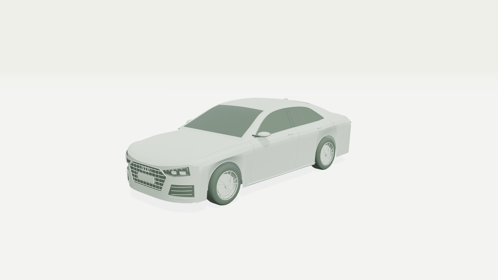
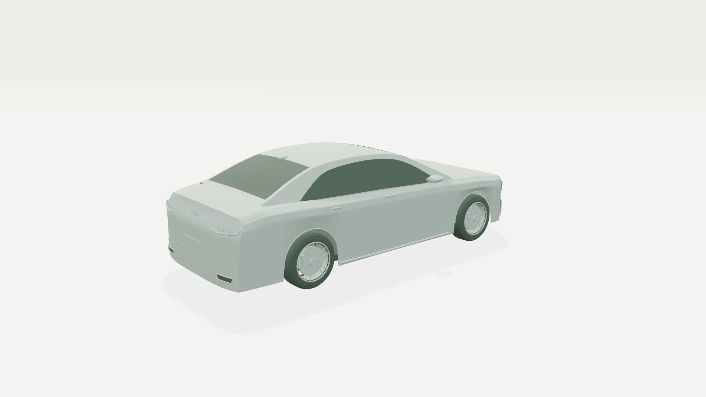

# A4 v0.3：大形修改前后对照

本轮对照基线：`ff51ba2` 中的 v0.1 车辆几何；修改后为 v0.3。两者使用同一份官方图纸、同一套标定、同一输出分辨率。没有平移或拉伸图纸迁就模型。

**怎么看：** 优先看侧视的车顶后半段和尾厢过渡，再看俯视的车头圆角；最后看纯模型与白模，不要只看叠图。图纸黑线不是原厂三维 CAD，也不提供真实曲面的毫米级精度保证。

## 1. 正侧：后车顶与尾厢过渡

| 修改前 | 修改后 |
|---|---|
|  |  |

后风挡原先过早下落，尾厢上缘偏低。本轮延后收束，重建平滑车顶轮廓；侧窗依据同一张官方 PDF 的二维边界采样，玻璃、窗框与 B 柱共用横向映射。

## 2. 俯视：前端圆角与座舱

| 修改前 | 修改后 |
|---|---|
|  |  |

前端外角由偏方调整为集中圆角。后视镜纵向位置和高度作估算修正；前后挡风玻璃的边界、弧度仍简化，不能把侧视拟合良好等同于俯视完全准确。

## 3. 正前 / 正后：检查修改是否破坏其他方向

| 修改前 | 修改后 |
|---|---|
|  |  |
|  |  |

保留尺寸主约束。镜壳仍是简化体，前后下包围、灯组和保险杠不是已核定选装配置的精确复刻。图线自身的轮距残差没有通过变形隐藏。

## 4. 纯模型：不让图纸线条替代几何细节

| 修改前 | 修改后 |
|---|---|
|  |  |
|  |  |

## 5. 固定白模：相同摄影棚、机位与光照

| 修改前 | 修改后 |
|---|---|
|  |  |

相机约 `(-6.5, 2.6, 6)`、目标 `(0, 0.69, 0)`，车辆灯关闭、零转向。没有通过更换灯光夸大改善。

补充后侧观察（无修改前同机位配对）：

## 仍未完成

- 车尾封口、肩线和翼子板仍偏概括，局部反射不够连续。
- 风挡边缘、镜壳、灯腔、轮毂和底部仍需精细建模。
- 后门接缝和轮拱局部轮廓未全面匹配官方图线。
- 没有照片相机标定、材质测量、精细内饰或全车还原率。

本轮证明的是“在固定参考条件下，大形可以继续修正”，不是已达到汽车广告级出片质量。验证详情见 [QA](2026-10-02-a4-v03-qa.md)，原图与导出条件见 [样张清单](v03/manifest.json)。
