# A4 v0.4：肩线、翼子板与端部曲面对照

本轮从 **v0.3 的未提交工作区**继续，不是从 Git HEAD 的 v0.1 车模重新开始。当前仍是公开二维资料约束下的程序化近似，未达到写实汽车广告质量。

## 观察条件

- 前侧机位 `(-6.5, 2.6, 6)`；后侧 `(6.5, 2.35, -6)`；目标统一为 `(0, 0.7, 0)`。
- 同一摄影棚、环境反射、曝光、材质参数，零转向、关闭车灯。
- 车漆对照统一石墨灰；白模统一原有白模材质。未通过更换灯光掩盖问题。
- 四视图沿用原 PDF 和固定等比标定，图纸不透明度 80%。旧图直接引用 v0.3 成果，不重复生成冒充基线。
- 新增 14 张 1920 × 1080 PNG，另引用 6 张原 v0.3 校准图。文件哈希与条件见 [清单](v04/manifest.json)。

## 1. 后侧白模：端面不再直接硬接侧面

| v0.3 | v0.4 |
|---|---|
| 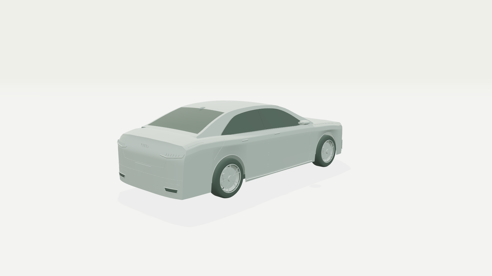 | 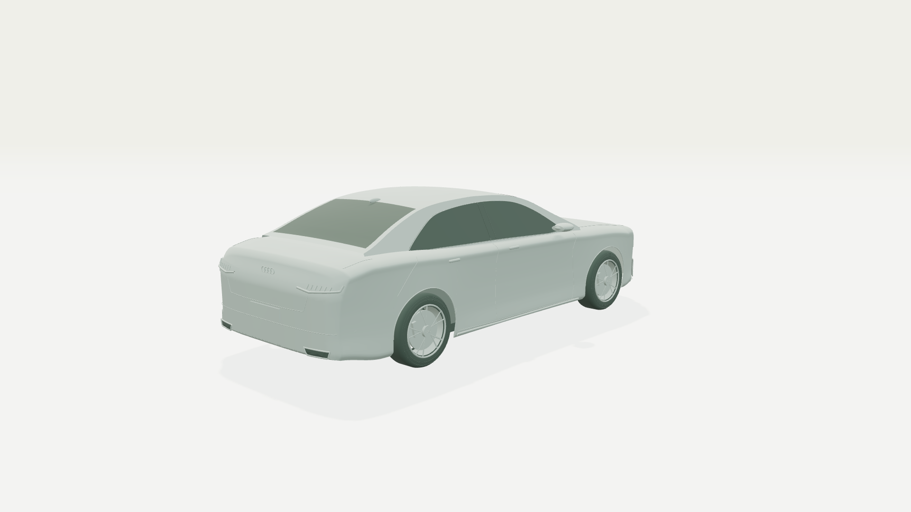 |

封口外围增加切线过渡带，车尾下缘上收；肩线到门板的截面由折线改为保形三次曲线。车尾总体仍偏概括，号牌区域、尾厢和下包围尚未按具体配置细分成完整零件。

## 2. 后侧车漆：检查高光，而不只看轮廓

| v0.3 | v0.4 |
|---|---|
| 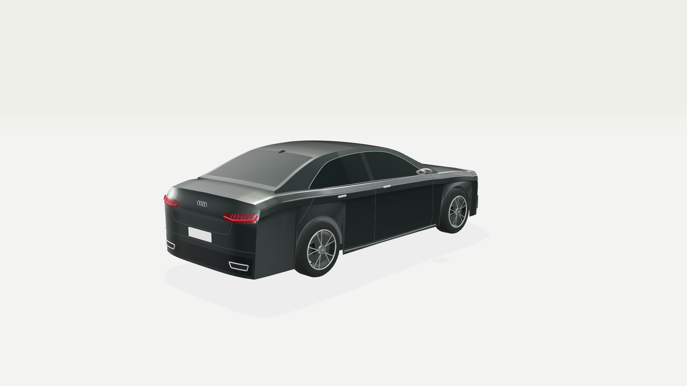 | 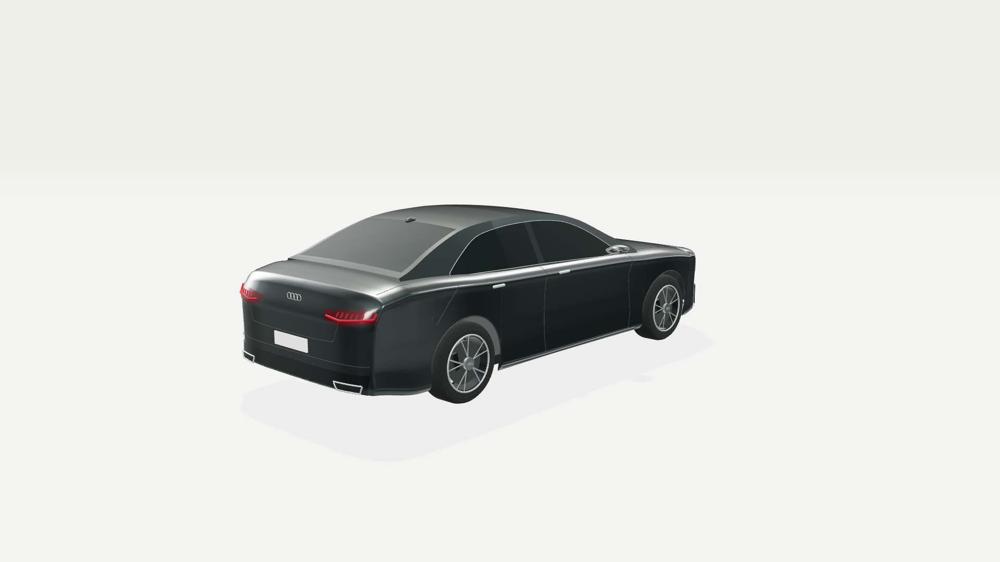 |

原来轮拱周围向上压缩截面形成的突变有所减轻；门板中部轻微内收，轮拱周围保留体积。尾灯外角和饰条反求新蒙皮位置，必要时绕到翼子板；尾灯贴面使用参数微分法线，避免独立三角面高光。

**注意：** 高光更连续不等于曲率真实。当前横向曲率仍为人工估算，尚无照片相机标定或实车扫描验证。

## 3. 前侧：同时检查另一端是否退步

| v0.3 | v0.4 |
|---|---|
|  | 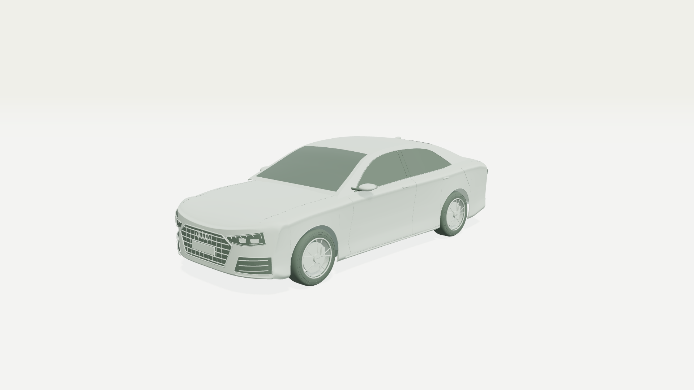 |
| 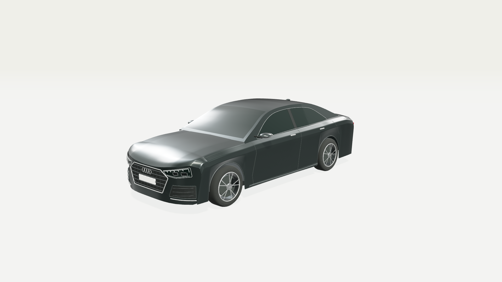 | 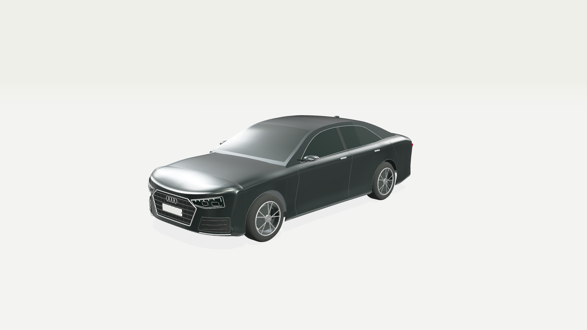 |

车头硬边和翼子板截面已平滑，但机盖前角仍存在不够自然的局部反射。格栅、进气口和灯腔仍为简化结构。本轮没有把这些问题用新材质或环境替换掉。

## 4. 四视固定标定复核

| v0.3 | v0.4 |
|---|---|
|  | 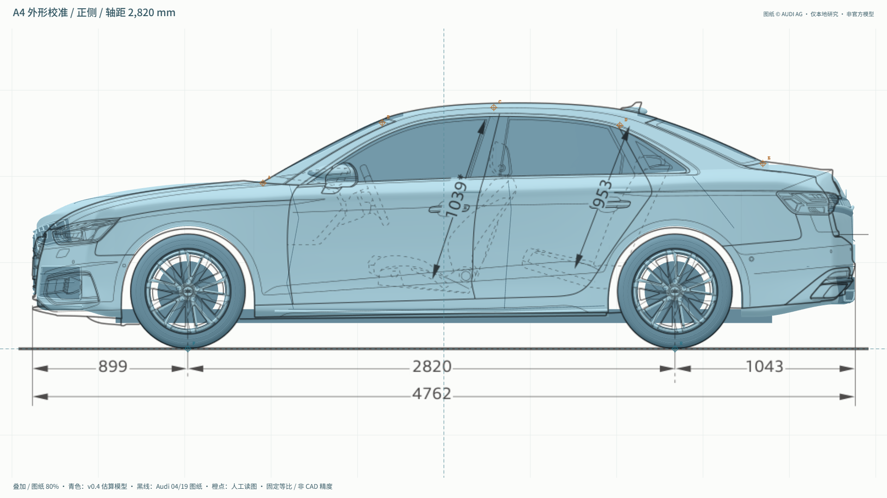 |
| 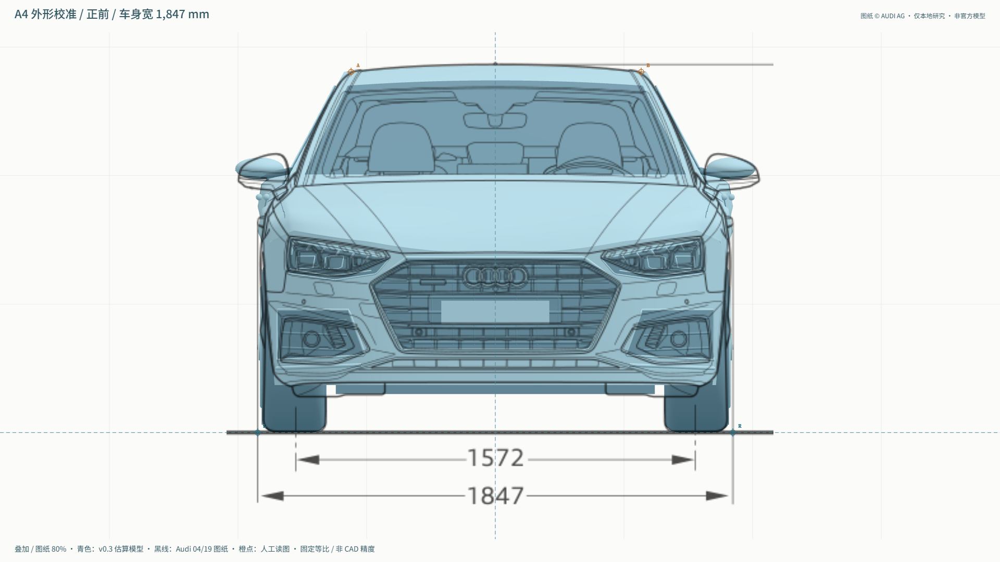 | 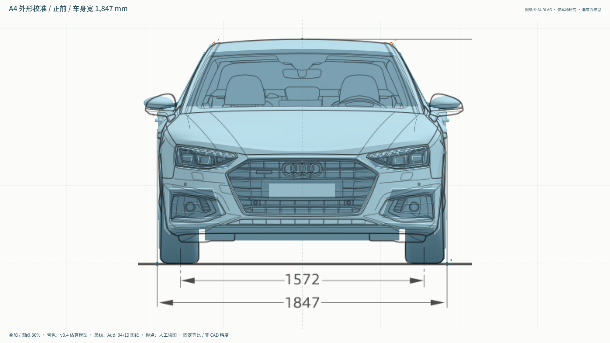 |
| 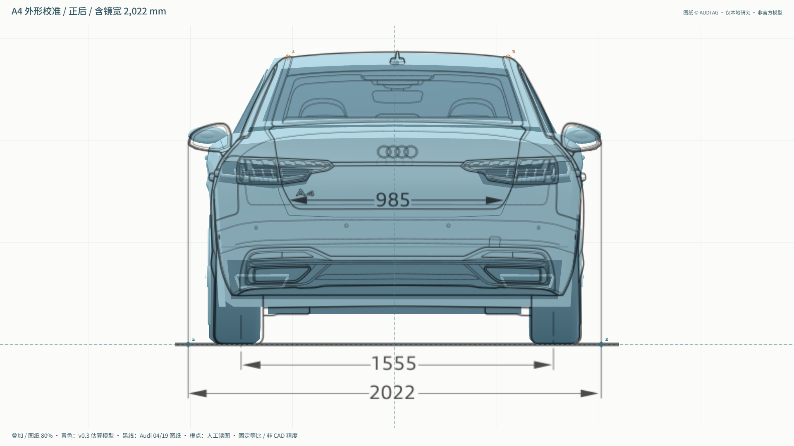 | 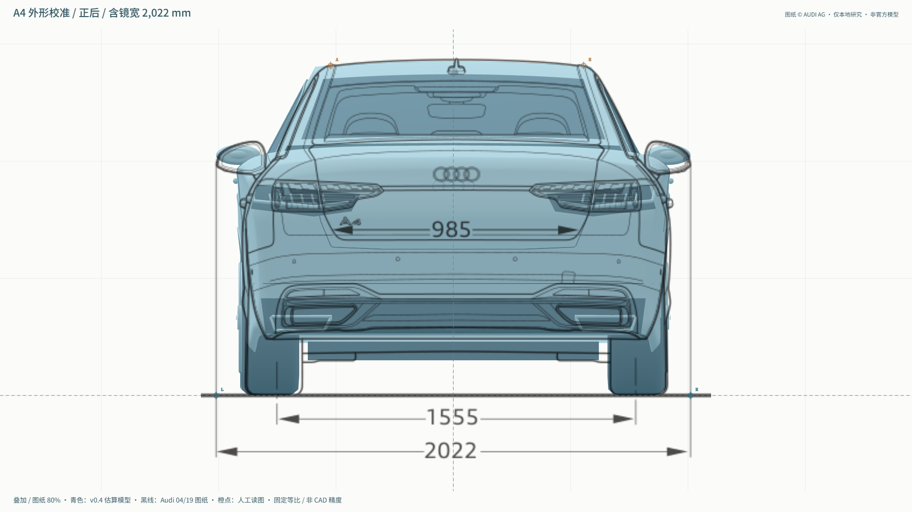 |
|  | 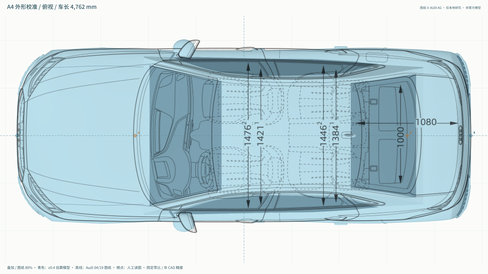 |

车顶、轴距和主尺寸未改，保险杠下缘与轮拱周围变化可直接比较。后视镜、风挡边界、侧门分缝、灯组轮廓和部分前后端轮廓仍与图纸不重合；不宣称全车贴图线完成。

## 5. 去掉图纸，看真实几何

| v0.3 | v0.4 |
|---|---|
| 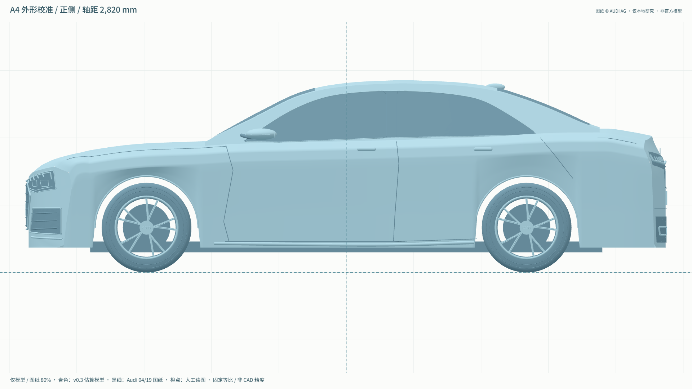 |  |
| 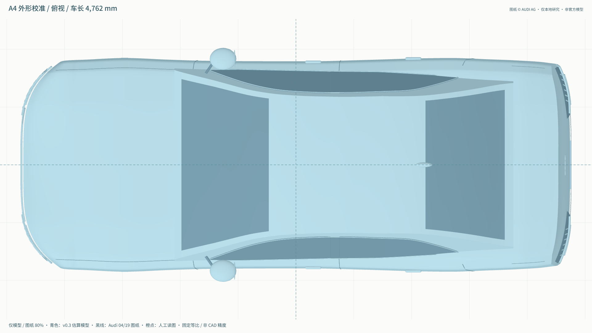 | 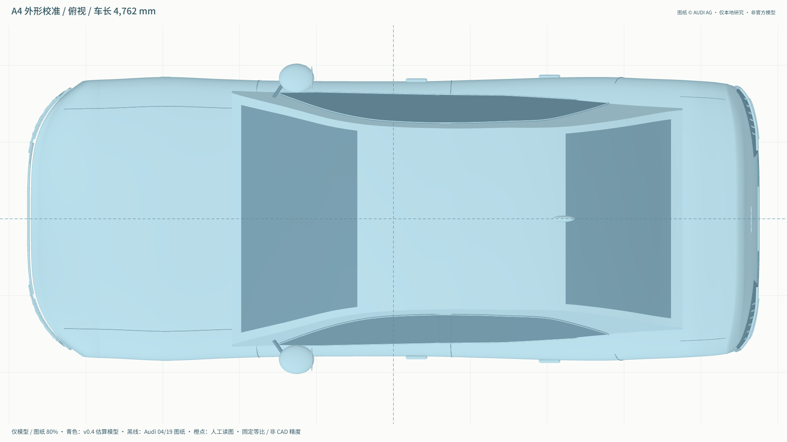 |

## 下一步

优先修风挡 / A、C 柱边界和门缝，再按明确的车型配置细化灯腔、格栅与轮毂；继续保留白模和深色车漆两种检查。暂不以增加场景、滤镜或渲染耗时替代几何精修。

测试、导出和已知限制见 [验证记录](2026-10-02-a4-v04-qa.md)。
