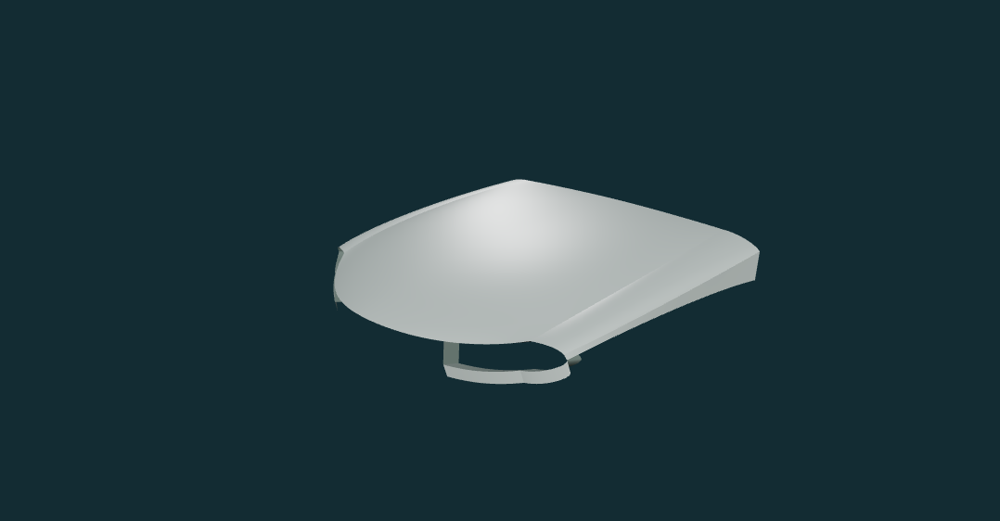

# BMW G20 阶段 2：局部曲面技术小样

2026-10-03，起点 `10f2737`。用户确认将 C 近侧机位降为定性参考后，开始有限的机盖—灯角—翼子板白模。**本轮是实际曲面初样，不是完整车头；工程检查已完成，造型待用户审阅。**

## 1. 可见交付物

入口仍为 `/#bmw`，默认显示自由视角白模，可拖动旋转或选择左前高位、右前高位、正前、侧前、背面。切换白模、法线、反射条纹和控制网；展开“局部控制实验”可改变机盖内部两点高度，再恢复基线。

以下截图只含自行生成的几何，没有官方图片或贴图，可随代码保存：

照片对照仍需选择本地对应原图，按原尺寸与 SHA-256 核对。两组照片机位使用**同一控制网**，没有按图各造一个车头。自由视角不显示照片、二维锚点或相机 RMS。

## 2. 与之前“加细节”的区别

- 曲面源是有语义的 4×4 控制网，而非 A4 的统一截面蒙皮；没有借用 A4 形状或零件。
- 机盖母面精确细分为两个区域；翼子板冠部、侧带、灯下带及内返边分别建面。
- 灯口由六段边界围成，真实贯通；内返边向后延伸 80 mm（估计值），未放置黑色封口面、灯罩图片或灯内件。射线检查灯口中心前后无蒙皮命中。
- 全部使用同一密度的确定性采样。声明共边的位置复用，折线保留自身法线；没有通过平均法线伪装光滑。
- 机盖内部控制实验不会改变灯口、外边、翼子板或其余块；内部两区仍然连续。它是技术实验，不是实车尺寸滑块。

本轮没有实现双肾、中央连接板、完整保险杠/轮拱、灯光、车标、纹理、整车或导出功能。灯口的内侧和保险杠方向仍有明确截断边，不能把这个开放小样当作封闭实体车身。

## 3. 证据与估算怎样分开

### 本轮实际查看的图片

- P90549627：右前角临时相机 A。
- P90549630：左前角临时相机 B。
- P90549639：同图组的灯角、机盖缝及翼子板局部，只作结构观察，没有另行标定相机。
- P90549635：仅在完成初样后作侧向定性叠图，不进入控制点拟合目标。

没有查看或用留出图修形。完整配置 `partial`、尺度适用性 `pending`、原相机文件及原标注不变；单独新增 `surfaceStudyApproval`，不把旧三机位相机关记为通过，也不放行完整车头/整车。

### 控制网并非从照片唯一解算

先在 A/B 上人工观察机盖前缘中点、风挡下方中点、灯内端、灯外端和机盖侧缝。做过两种离线量级检查：

1. 把两张近侧灯镜像成同一侧后求交，部分点会得到明显不合理深度（两种镜像后观察方向过近且读点不一致）；**没有把这些结果直接用于曲面**。
2. 改看同一个左灯在 A 的远侧、B 的近侧位置，临时相机给出的机盖前缘中点约为 `(-2.213, 0.709, -0.005)` m、后方中点约为 `(-0.613, 0.992, 0.009)` m，作为手工网格量级参考。远侧灯边界难读，部分点重投影残差约 16–32 px，外端横向位置也不稳定，不能冒充三维测量。

最终控制网以 `kind: approximation` 保存。灯外端、翼子板宽度、拱度和内返边深度仍是人工选择；没有运行自动曲面优化器，没有“还原率”或实车毫米精度。单纯增加 Bézier 面数不会弥补这些证据问题。

## 4. 数值与拓扑验证

| 项目 | 本轮结果 / 范围 |
|---|---|
| 曲面数量 | 每半边 12 块，镜像后 24 块 |
| 三角面 | 27,648；每块使用 24×24 网格 |
| 声明共边最大差 | 约 `4.7e-16 m`，是算法拼接误差，不是实车精度 |
| 声明 smooth 的法线差 | 小于 1° 门槛；界面保留四位小数为 0.0000° |
| 镜像 | 顶点/法线 Z 反号，三角形绕序反转；中线横向法线为零 |
| 有意不光滑的连接 | 机盖与翼子板、翼子板肩侧、灯口折返等声明 crease；不声称全部 G1 / G2 |
| 开放边 | 每半边 18 条，全部在 `boundaryPolicy` 中声明镜像、截断或灯腔后方开放用途 |
| 非法状态 | 非有限/退化控制网、非法参数、重复配边、错误边界、反向光滑法线、退化或局部回折三角形会报错 |

测试包含解析偏导与有限差分、精确细分、反向共边、共享位置、确定性、镜像、灯口射线以及 ±40 mm 控制点实验与恢复。使用 DoubleSide 只是为了从背面查看开放小样；绕序/解析法线在生成时另行检查，不依赖双面材质隐藏反面。

限制：有限采样与局部三角形检查不是任意曲面全局无自交证明；没有实现任意修剪、布尔、自动适应细分或 CAD 实体内核。当前母面细分的光滑连接已验证，但没有宣称所有独立面片都已达到汽车 Class-A 曲面质量。

## 5. 真实浏览器观察与残留缺陷

### 已检查

- 左右前高位、正前、侧前、背面白模；法线、条纹与控制网；拱度改变/恢复。
- A/B 原图、白模、叠加三种模式；C 定性侧向参考；旧骨架模式回归。
- A/B 上局部覆盖位置与机盖/灯区大致对应，但叠加透明显示不等同于轮廓数值验收。下方的 RMS 明确标为**旧骨架相机残差**，不随曲面修改而降低。
- 自由检查使用独立相机，不修改已保存的照片相机。构建只在拱度改变时进行，不每帧重建；尚未做交互帧率或 Worker 性能验收。
- 390×844 工作台实测宽度/内容宽度均 390 px。首次目视发现模型右侧在窄屏被裁掉，已按宽高比调整自由相机视场；重拍确认完整显示。按钮文字也已修复为不拆行。

### 最大的三个造型问题

1. **机盖折线偏软。** 当前大面仍像通用圆滑板件，没有把实车中央面与两侧特征带的锐度和曲率变化表达充分。
2. **灯口外端偏圆，内返边偏简化。** 已有真实开口，但其上/下缘与外角的折向还没有充分贴合实车；深度是估计，不能当真实灯壳。
3. **翼子板只有上肩窄带。** 下缘是研究截断边，不是完整轮拱；它无法证明保险杠与车轮周边的体积关系已经正确。

从正前看仍是开放的局部部件，不能根据它判定双肾比例、鼻梁、保险杠和整体 G20 神态。**本轮证明了纯代码分区曲面可以实现和检查，不证明现有资料已经足以达到用户期待的写实车头。**

## 6. 工程回归与本机记录

- 第一轮全量：22 个测试文件、155 项通过；补充中线镜像接边测试后，**最终 22 文件、156 项通过**（29.27 秒）。
- 新增几何定向测试：16 项通过。原相机 Python 合成测试：5 项通过。
- TypeScript / Vite 构建通过。BMW 独立 JS 约 48.46 kB；主包约 905.47 kB，原有大包告警保留。
- BMW 页面及 A4 校准页无 warning/error。A4 摄影棚保留一条既有 WebGL 着色器舍入 warning，没有 error；两页实际截图已查看。
- 首轮浏览器脚本在 A4 校准页等待了错误文本，超时后清理本任务实例；修正等待文本并完整重跑成功，不把首次失败隐藏为通过。
- 复用 `127.0.0.1:52254`、Vite PID 15416。独立 MCP 实例沿用用户授权的仅项目目录 root、默认隐藏子进程与无头浏览器；最终实例 PID 25532，已关闭本任务页面和实例，未触碰其他浏览器。私有图片和 `.codex/config.toml` 的 HTTP 访问仍为 403。

日志与含官图的截图在 `.runtime/bmw-g20-front-corner/`，不进入 Git；本文件引用的两张纯白模/条纹图不含原图。`result.json`、`tools.log`、`browser-final.log`、`tests-final.log`、`geometry-final.log` 和 `build-final.log` 可供本地核对。端口仅是本轮记录，下次仍需检查。

## 7. 下一轮建议

先围绕以上三个最大差距修一次局部控制网，固定 A/B 临时相机和同一组截图比较，不先堆灯光、格栅细节或扩整车。优先拆出更有控制力的机盖特征带、收紧灯外角，检查翼子板肩部转折。新的曲面分区必须继续满足共边/法线测试。

这属于小样的造型修正；完整车头可行性关尚未开始。只有小样方向得到用户认可后，才讨论扩大到双肾、保险杠及完整前轮拱。主计划“首次白模后最多两轮有明确目标的修正，仍无实质改善则止损/改线”的约束保持不变。
