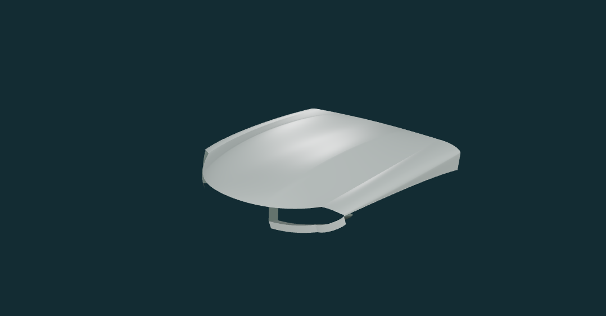
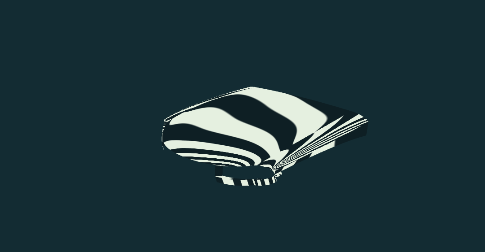
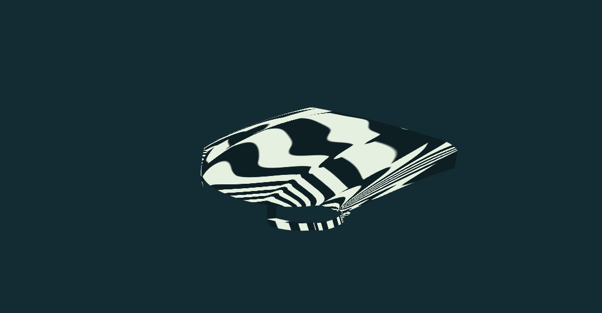

# BMW G20 局部小样：第一轮造型修正

2026-10-03；基线提交 `d2ed1ec`。用户选择“先修正小样”，本轮仅针对机盖特征带、灯口外端与翼子板肩部。**工程检查通过，视觉待用户审阅；未进入阶段 3，也未添加完整车头。**

## 1. 怎样看改动

打开本地开发服务的 `/#bmw`，默认是“本轮修正”。点击“原始小样 / 本轮修正”，自由机位、照片相机、原图、显示模式与透明度均保持不变；只将实验拱度归零，避免把滑块变形误当版本差异。

建议先看左前高位的白模，再切换反射条纹，最后看正前、右前高位和侧前。不要用灯光、徽标或纹理判断是否更像实车，本轮没有增加这些东西。

下面为同一机位、同一材质、同一灯光的自建几何截图，不含官图。

| 原始小样 V1 | 本轮修正 R1 |
|---|---|
|  |  |
|  |  |

## 2. 三项修正及其限制

### 机盖：中央面与特征带分开控制

- 原版机盖母面只在 v=0.62 精确二分。本轮在 v=0.54 再拆分，得到中央、窄特征带、外带；不是单纯增加采样密度。
- 高度修正由三段三次曲线形成，共享全局 v 导数；纵向控制排增量为 `[0, 52, 45, 0]` mm。这些是**人工控制点增量，不是实车测量**。u=0.5、v=0.54 处表面升高约 36.4 mm。
- 前后边、外侧接缝、中线位置与中线横向法线保持；没有改变照片相机或拉伸照片。实验滑块仍只改原母面内部两点。
- 白模中能看到更清楚的纵向特征带；条纹经过该区域有更集中的转折。但 G1 不代表 G2，条纹仍有曲率变化偏急的问题，不能称为 Class-A 曲面。

### 灯口：收紧外端而不封口

- 共用冠部末端、侧带及灯下边界重新组织外端折向，短边端点弦长由约 25.8 mm 降至 10.4 mm。这只是两版网格参数对比，不是原厂灯尖尺寸。
- 灯尖比原版紧凑；侧前白模仍可观察到简化的内返边。原 80 mm 后向内返深度估计不变，没有加入黑面、灯罩、发光或内件。
- 双侧灯口中心射线贯通，同时灯下带射线能命中，避免“模型漏建导致任何射线都不命中”的假通过。

### 翼子板：冠部向侧带的切向过渡

- 调整冠部中间控制点；侧带首排按冠部末端切向的正比例 0.25 延伸。接边从原来的有意折线改为解析 G1，实际法线而非平均法线通过检查。
- 原肩部接边最大法线差约 49.6°，本轮约 `1.48e-6°`；这是声明连接处的算法连续性，不是实车表面精度。
- 肩部到侧面的反光过渡更连贯，但后方/下方仍是截断面，没有补轮拱，也不能据此验收保险杠与车轮之间的体积关系。

## 3. 证据和相机边界

- 查看 P90549627（A）、P90549630（B）、P90549639 局部官图作为形态观察。A/B 原图经尺寸和 SHA-256 校验后在本机载入，并归档两版同机位叠加。
- 完成修正后查看 P90549635（C）的定性叠加，不用它调形；4 张留出图未查看或参与本轮修改。**没有新的留出集形状指标。**
- `cameras.json`、`landmarks.json`、`skeleton.json` 与原始 `front-corner.json` 没有改动。A/B 仍是临时工作假设，配置仍 `partial`，尺度适用性仍 `pending`。
- A/B 叠加中大体覆盖位置沿用旧版，后部截断、灯口局部对齐和深度仍存在不确定性。没有运行自动优化器，没有新增独立曲面特征点误差或轮廓精度报告。
- 界面 A/B 骨架 RMS 仍为约 36.2 / 27.2 px，切换曲面不改变它；该值**不是本轮形状改善指标**。

## 4. 工程结果

| 项目 | 结果 |
|---|---|
| 修正版面片 / 三角面 | 26 / 29,952；旧版 24 / 27,648；统一 24×24 采样 |
| 声明共边最大差 | `4.71e-16 m` |
| smooth 接边最大法线差 | 约 `1.48e-6°`，未提高 1° 门槛 |
| 每侧声明开放边 | 修正版 20 条，旧版 18 条；多出的两条为新特征带前后截断边 |
| 原版保持 | 修改前冻结控制网/连接哈希及全部网格位置、法线、索引哈希，回归一致 |
| 镜像、绕序、有限值 | 原有测试继续通过；两版 ±40 mm 拱度下无采样退化/局部回折 |
| 全量测试 | 23 文件、164 项通过；新增小样回归 8 项 |
| 构建 | TypeScript 与 Vite 通过；原有约 905.47 kB 主包告警保留 |

新增测试先执行得到 5 失败 / 3 通过，失败来自未实现的版本/特征带/光滑连接能力。首次实现被 G1 测试抓到 de Casteljau 共点数组别名导致高度加两次；改为编辑前逐面深拷贝后通过，没有靠放宽门槛掩盖问题。

真实浏览器检查：

- 两版五个自由机位白模，条纹、法线、控制网，以及 A/B 原图叠加和 C 定性叠加。
- 独立引擎检查 9 项：版本改变画面、自由机位往返画面哈希一致、材质不重建、非法参数/版本保留旧画面、恢复清错、统计版本正确、照片机位往返一致、销毁移除画布。
- 实际 UI 版本切换保留照片、相机、模式和透明度；390×844 下宽度/内容宽度均 390 px，画布 360×390，按钮和模型未横向裁切；+40 mm 实验在版本切换时归零。
- A4 摄影棚在 526 px 窗口截图可见车模；1440 px 下场景状态正常。A4 校准页的结构快照及实际 2D 合成画布读回已查看。本轮 BMW / A4 检查未发现控制台 warning/error。
- 没有重做 GLB/PNG 导出、独显帧率或全局自交证明；不能把本轮有限回归写成全量展示验收。

### 工具限制也如实保留

首次用窗口 resize 请求 390 px，Chrome 实际宽度是 526 px，未把该截图作为 390 px 验收。改用页面设备模拟后实测 390 px，并重新截图。设备模拟触发页面重载，旧元素 ID 失效后重新读取快照，没有复用失效 ID。

A4 桌面摄影棚及校准截图调用各超时一次（120 秒）；没有关闭其他任务浏览器或修改安全策略。摄影棚保留已成功的窄屏截图，校准使用同一浏览器页面中的实际画布 PNG 读回验证，**没有声称两张超时的桌面截图已归档**。BMW 本轮对照截图正常保存并查看。

## 5. 最大的剩余问题

1. **机盖前缘仍像连续圆弧。** 本轮刻意冻结前缘，只增强面内特征带，尚未处理双肾上方鼻梁和边缘转折，因此正前神态改善有限。
2. **灯口仍不是完整灯壳。** 外端虽收紧，下带宽度、内端截断与内返深度仍简化，不能用于近景灯具验收。
3. **翼子板仍只有上肩。** 没有轮拱、保险杠和更完整侧面，无法检验整车体积；同时机盖—翼子板仍是声明的折线接边，不是实体板缝或整车 G1。

结论：本轮有可观察的局部形态变化，工程检查通过，但仅提交小样审阅。是否认可方向由用户决定；不自动进入完整车头或追加装饰细节。

## 6. 复现与本机记录

```powershell
npm test -- src/validation/bmw-g20/front-corner-refinement.test.ts src/validation/bmw-g20/front-corner.test.ts
npm test
npm run build
git diff --check
```

- 新参数：`src/vehicles/bmw-g20/patches/front-corner-refinement.json`。
- 旧数据：`src/vehicles/bmw-g20/patches/front-corner.json`，原封保留。
- 生成：`buildFrontCorner(0, 24, 'baseline' | 'refined')`；默认 `refined`。
- 本轮复用 `http://127.0.0.1:54461/`，Vite PID 6040。实际下次运行仍以 `.runtime/preview.json` 和进程核对为准。
- 本轮日志/原图叠加/全部自由机位在 `.runtime/bmw-corner-refine-r1/`：`frozen-hashes.json`、`geometry-report.json`、`browser-engine-check.json`、`browser-ui-check.json`、`mobile-layout-exact.json`、`mobile-controls.json`、测试与构建日志。
- 官图没有复制进公开目录或 Git。只有本文四张自建几何图归入文档。未提交、未推送、未部署公网。
